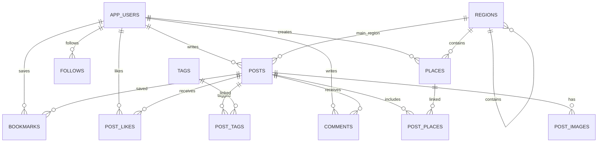

# ERD

```mermaid
erDiagram
  APP_USERS ||--o{ POSTS : writes
  APP_USERS ||--o{ COMMENTS : writes
  APP_USERS ||--o{ POST_LIKES : likes
  APP_USERS ||--o{ BOOKMARKS : saves
  APP_USERS ||--o{ FOLLOWS : follows
  APP_USERS ||--o{ PLACES : creates

  REGIONS ||--o{ REGIONS : contains
  REGIONS ||--o{ PLACES : contains
  REGIONS ||--o{ POSTS : main_region

  POSTS ||--o{ POST_IMAGES : has
  POSTS ||--o{ POST_PLACES : includes
  POSTS ||--o{ POST_TAGS : tagged
  POSTS ||--o{ COMMENTS : receives
  POSTS ||--o{ POST_LIKES : receives
  POSTS ||--o{ BOOKMARKS : saved

  PLACES ||--o{ POST_PLACES : linked
  TAGS ||--o{ POST_TAGS : linked
```

피드와 탐색은 별도 테이블이 아닙니다. 동일한 `posts` 데이터를 지역과 정렬 조건에 따라 다르게 조회합니다.
